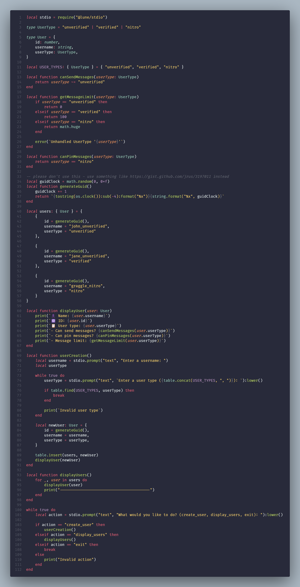

# 🫡 Lune `Hello World!`

A very simple, strongly-typed, command-line Luau application.

🖌 Check out the code with formatting!

 

## Instructions

1. [Install Lune](https://lune-org.github.io/docs/getting-started/1-installation).
2. Run `lune build init.luau`.
3. Execute the outputted `init.exe` file.